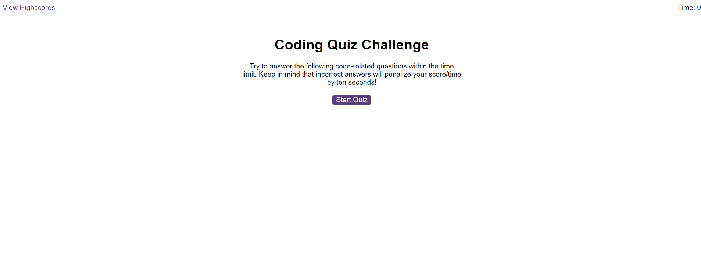

# Javascript_Coding_Quiz

## Description

This application is a timed, multiple-choice Javascript coding quiz that will keep track of high scores.

## Installation

N/A

## Usage

You can try out the Javascript coding quiz if you click this link:

https://sara-badini-confalonieri.github.io/Javascript_Coding_Quiz

* Click on the 'Start Quiz' button
* Select an one of the 4 answers for each questions 
    * If the answer is incorrect 10 seconds will be subtracted from the timer
* After completing the quiz you will need to enter your initials and your score will be saved in the local storage
* The highscore page will display the scores in a list, from the highest score to the lowest.
* Click on the 'Clear Highscore' button if you want to clear all the scores.
* Click on the 'Go Back' button if you want to re-try the quiz.

## Credits

N/A

## License

Please refer to the LICENSE in the repo.

